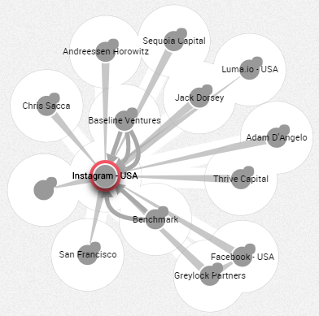

## Colores predeterminados

El color predeterminado de los nodos puede ser definido por el administrador de Linkurious Enterprise. En este caso el color predeterminado es gris.

Cuando usted selecciona nodos y relaciones, estos son resaltados inmediatamente en rojo y un halo blanco aparece en sus nodos conectados.

