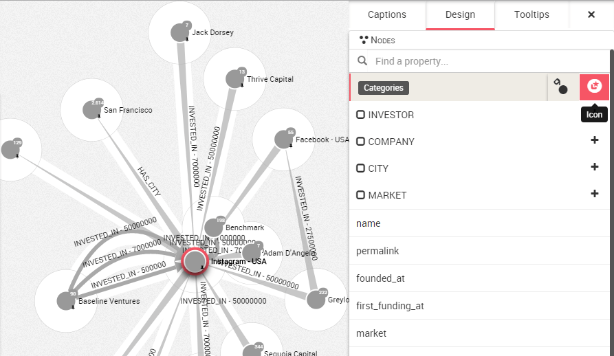
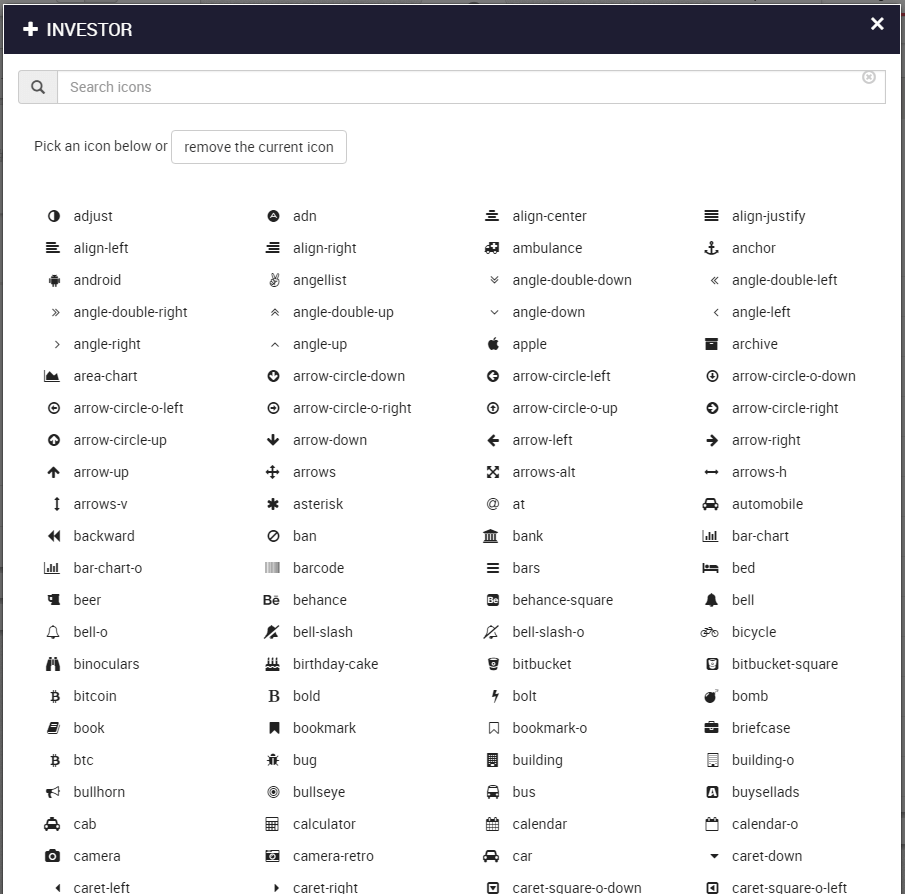
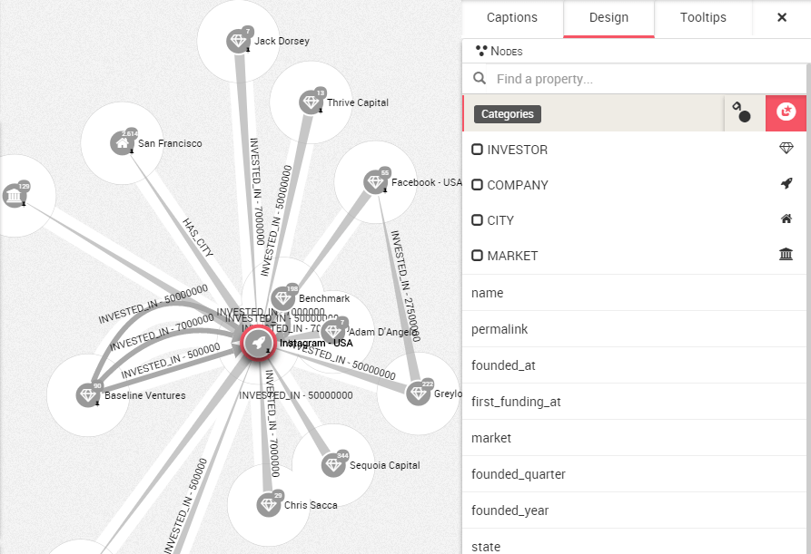

# Iconos

Para obtener una visualización más intuitiva, Linkurious Enterprise le permite cambiar la apariencia de los nodos mediante un conjunto de iconos proporcionados por ```Font Awesonme``` (https://fortawesome.github.io/Font-Awesome/)

Hacemos clic en la esquina del espacio de trabajo para abrir el panel de diseño y seleccionamos la pestaña ```Nodes```.

Movemos el ratón por ejemplo a ```categories``` y tenemos acceso al botón de colorear y al botón de cambiar iconos. 



Pulsando en el botón "+", aparece la lista de iconos disponibles. Es posible seleccionar el icono que queremos para ilustrar nuestra propiedad.



Por tanto podemos ilustrar nuestro grafo con iconos para obtener directamente una explicación visual de los datos en un primer vistazo.



Aquí hemos escogido 4 iconos para diferenciar los nodos de tipo ```Company``` de acuerdo a su propiedad
- Los inversores son representados con el icono de un diamante
- Las empresas son representadas con el icono de un cohete
- Las ciudades son representadas con el icono de una casa
- Los mercados son representados con el icono de una institución