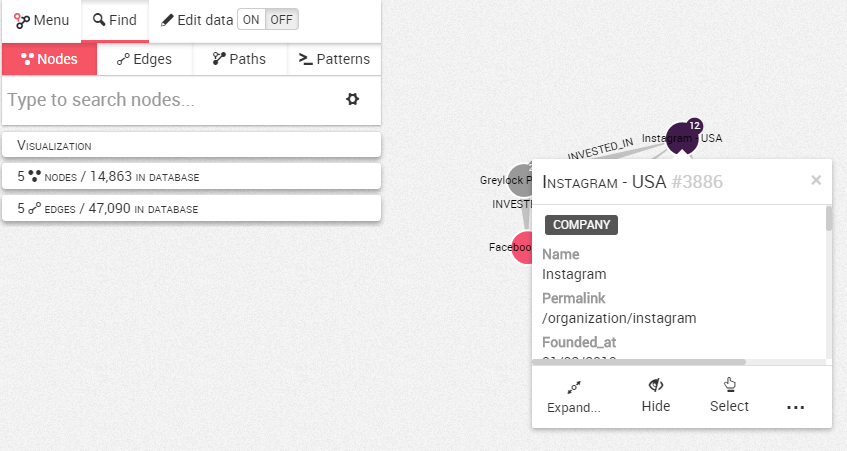
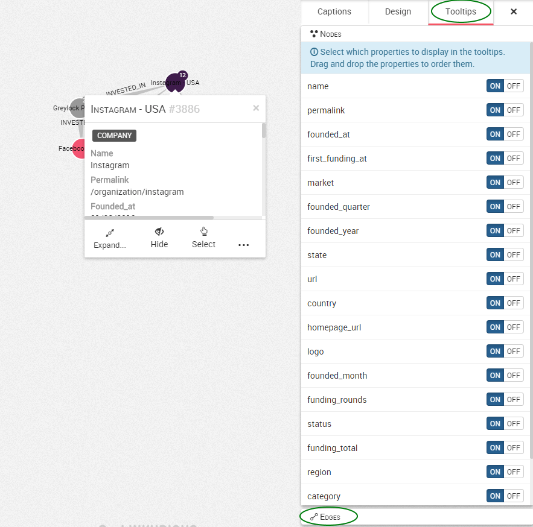

## Personalizar los tooltips (descripciones emergentes)

Cuando usted hace clic derecho en un nodo o relación, puede ver sus propiedades en un menú emergente llamado tooltip.



Podemos ver que nuestro nodo tiene la categoría ```Company``` con el enlace permanente (permalink) ```/organization/instagram```.

Es posible personalizar el contenido del tooltip y mostrar solamente ciertas propiedades.

Para ello, necesitamos abrir el panel de diseño en el lado derecho y seleccionar la pestaña ```Tooltips```.



Podemos ver las diferentes propiedades de los nodos en nuestra visualización. Por defecto, todas las propiedades están activas (```on```) y por tanto son mostradas. En la parte inferior de la pantalla, es posible hacer lo mismo con las relaciones.

Podemos desactivar las propiedades que no queremos mostrar.