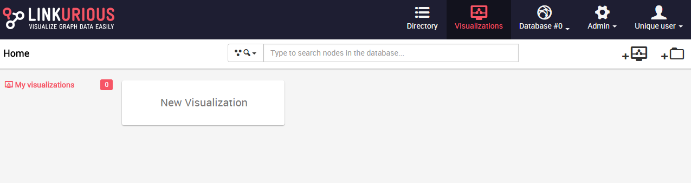

## Create a new visualization

To create a new visualization, we click on ```New Visualization```.



We can now search for a node or an edge.


We simply type the name of any property associated with the node or edge we are interested in.


We see a few suggestions. We Click on the one we are interested in.


Voilà, we can now visualize our result.
