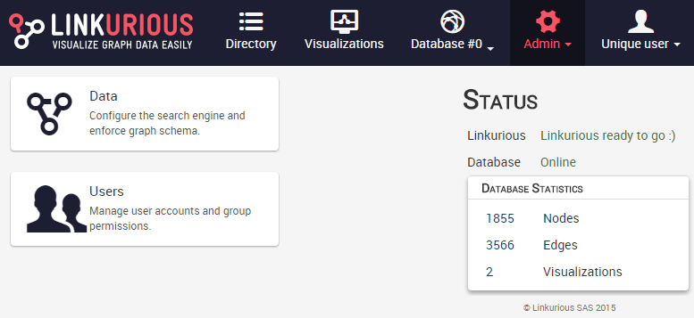

## Tableau de bord d'Administration

Le tableau de bord d'administration est disponible seulement aux utilisateurs administrateurs, c'est à dire les utilisateurs du groupe `admin`.

Pour y accèder, ouvrez le menu **Admin** de la barre de navigation puis cliquez sur **Status**.

Vous avez maintenant accès au tableau de bord administrateur. Le statut de Linkurious et l'actuelle source de données sont mentionnés sur la droite. Les statistiques de la base de données contiennent le nombre de noeuds et de liens de la base de données de graphes ainsi que le nombre de visualisations créées par les utilisateurs de Linkurious.

Le nom de la source de données est mentionnée dans la barre de navigation, avec  sources de données sans noms appelées *"Database #xx"*. Vous pouvez passer à une autre source de données à cet endroit.

