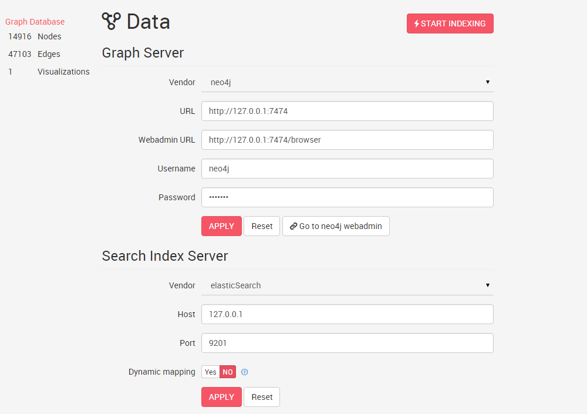

## Sources de données

Linkurious Enterprise se connecte à des sources de données locales ou à distance par HTTP et HTTPS. Les sources de données comme les serveurs de  Neo4j peuvent fournir un accès à différentes bases de données de graphes. Par exemple, il est commun de voir les utilisateurs de Neo4j passer d'une base de données à l'autre sur le même serveur  Neo4j. Linkurious Enterprise gère la configuration de plusieurs sources de données et détecte quelle base de données est actuellement disponible derrière la source de données connectée. 

### Ajouter une nouvelle source de données

1. Ouvrir le dossier Linkurious dans votre ordinateur
- Ouvrez le fichier localisé à `linkurious/data/config/production.json` avec votre éditeur de texte favori
- Cherchez la clé `dataSources`. Il s'agit d'une multitude de sources de données. Par défaut, une unique source de données est définie pour se connecter au serveur Neo4j localisé à l'adresse suivante: `http://localhost:7474/`.Copiez la configuration par défaut et éditez le distributeur `graphdb` et  `url` pour définir une seconde source de données.
- Redémarrez Linkurious pour prendre en compte les changements

### Editez une source de données à partir du tableau de bord

Pour accéder au tableau de bord de gestion de données, cliquez sur **Data** dans le tableau de bord de l'administrateur, ou selectionnez **Data** dans le menu **Admin** de la barre de navigation. Vous devriez voir l'écran suivant: 

Nous pouvons ici éditer la configuration de la source de données, installer et déclencher l'indexation de données. Pour éditer la configuration d'une autre source de données, passez à une autre source de données à partir de la barre de navigation.

### Rechercher un serveur

L'option de recherche utilise [Elasticsearch](https://www.elastic.co/products/elasticsearch) pour une recherche en temps réel d'un texte dans les noeuds et les liens. Un serveur incorporé Elasticsearch est fournit avec Linkurious mais vous devriez installer le vôtre. Par défaut, toutes les sources de données sont indexées dans la même version Elasticsearch, vous devriez configurer différentes versions Elasticsearch pour chaque source de données. Référez vous à la documentation officielle d'Elasticsearch pour installer votre propre arborescence. 
