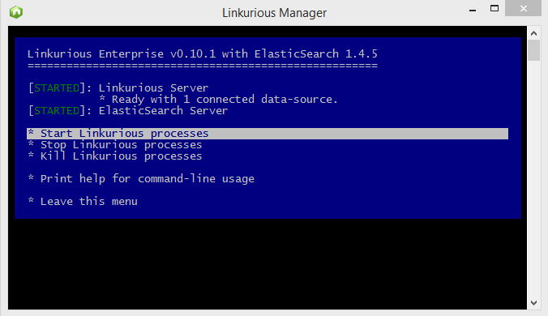

## Contrôle

### Contrôle des processus

Linkurious démarre 3 processus différents lorsqu'il est lancé:
1. `node` (or `node.exe`): Le processus interne gestionnaire ( gestionnaire [PM2](https://github.com/Unitech/pm2) )  
2. `node` (or `node.exe`): Le processus du serveur Linkurious
3. `java` (or `java.exe`): Le serveur d'indexation intégré [ElasticSearch](https://www.elastic.co/) 

Vérifiez si ces processus fonctionnent en ouvrant le menu du répertoire Linkurious (voir ci-dessous de quelle manière pour chaque sytème). Le menu apparaît comme dans l'image ci-dessous:



#### Linux systems

Démarrez `menu.sh` (le statut est au-dessus du menu). Une alternative est d'exécuter `menu.sh status`.

#### Mac OS X systems

Démarrez `menu.sh.command` (le statut est au-dessus du menu). Une alternative est d'exécuter `menu.sh.command status`.

#### Windows systems

Démarrez `menu.bat` (le statut est au-dessus du menu). Une alternative est d'exécuter `menu.bat status`.

### Statuts

#### Application

Le statut de l'application peut être retrouvé en requêtant le serveur Web de la manière suivante: 

> curl http://127.0.0.1:3000/api/status

**Success response:**

```
HTTP/1.1 200 OK
{
  "status": {
    "code": 200,
    "name": 'initialized',
    "message": 'Linkurious ready to go :)'
  }
}
```

"code" est le code du statut du serveur (100: démarrage, 200: OK, >400: problème), "name" est le nom du statut du serveur actuel, et "message" décrit le statut actuel du serveur. 

#### Data sources

Les statuts de toutes les sources de données peuvent-être retrouvées avec la requête suivante:

> curl http://127.0.0.1:3000/api/dataSources

**Success response:**

```
HTTP/1.1 200 OK
{
  "sources": [
    {"name":"Database #0","configIndex":0, "key":"a2e3c50f", "connected":true},
    {"name":"Database #1","configIndex":1, "key":null, "connected":false},
    {"name":"Database #2","configIndex":2, "key":null, "connected":false}
  ]
}
```

"configIndex" est l'index de la source de source dans la liste de configuration 'dataSources' (voir la section Configurdr), "key" est la clé unique qui identifie la source de données (nulle lorsque la source n'est pas connectée), et "connected" est `true` si la source est actuellement disponible.
