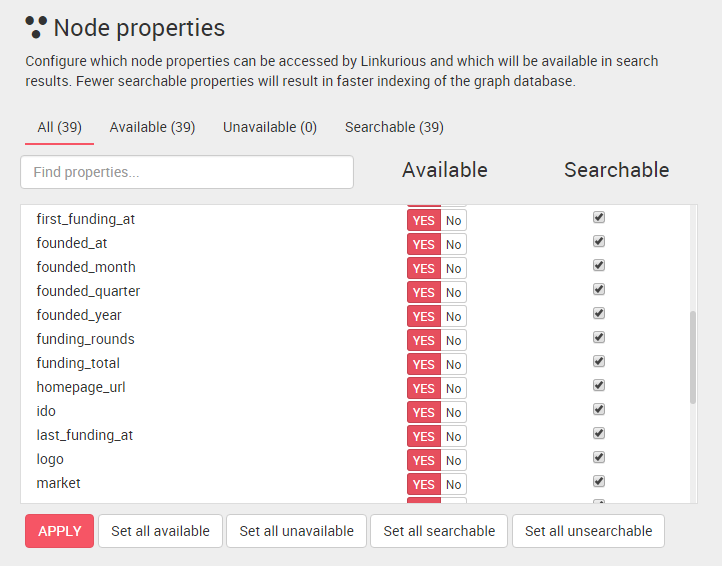

## Indexe de recherche

Choisissez quelles propriétés des noeuds et des liens seront utilisés dans les résultats de recherche en configurant l'indexe de recherche. 
Par défaut, Linkurious répertorie toutes les propriétés disponibles. Notez que les propriétés non disponibles ne sont pas répertoriées et ne peuvent donc pas être recherchés avec l'outil de recherche.

  Répertorier moins de donnerées réduira le temps d'indexation.

### Changer la liste des propriétés qu'il est possible de rechercher

Ouvrez le tableau de bord de gestion des données puis descendez à la section **Node properties**. Vérifiez les propriétés qui peuvent être recherchées.

Cliquez sur **Apply** lorsque vous avez terminé.

Nous pouvons configurer les propriétés des relations de la même façon dans la section **Edge properties**.

  Il est possible de ré-indexer les données pour appliquer les changements aux résultats de recherche.

