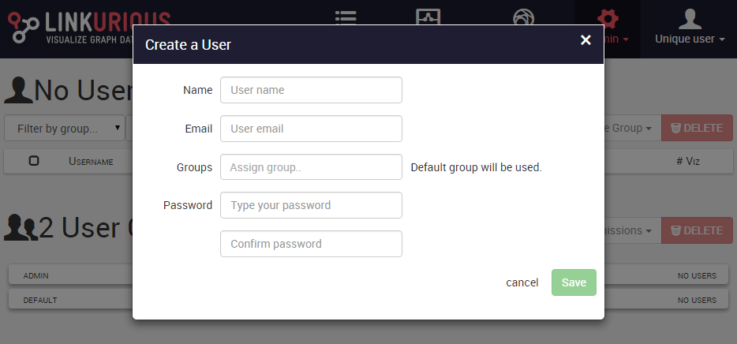
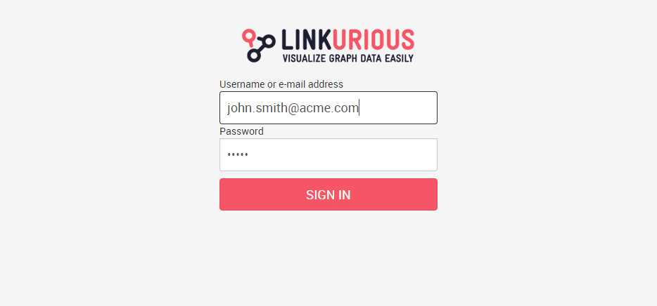

## Permettre l'identification des utilisateurs

  Nous vous recommandons fortement de mettre en place un système d'authentification des utilisateurs pour sécuriser l'accès aux données une fois que Linkurious est mis sur le serveur. Ceci vous permettra de limiter le nombre d'utilisateurs authentifiés en fonction des conditions de votre license.

Par défaut, l'authentification des utilisateurs est désactivée et toutes les actions sont effectuées sous un compte spécial appelé  *"Unique User"*. L'utilisateur unique peut faire tout ce qu'il veut  sans avoir à s'authentifier, de cette manière tout le monde peut accèder à la plateforme. Avant de pouvoir mettre en place l'authentification des utilisateurs, vous devez créer un compte Administrateur. 

  Si nous ne créons pas un compte Administrateur avant d'activer l'authentification, nous ne pourrons pas nous connecter.

Créons un compte Administrateur. Cliquez sur **Users** dans le tableau de bord administrateur et sélectionnez **Users** dans le menu **Admin** de la barre de navigation. Une fois le tableau de bord de gestion des utilisateurs ouvert, cliquez sur **Add** à côté de "No Users". Le formulaire de création d'ultilisateurs apparaît:

Remplissez tous les champs et ajoutez le groupe `admin`  dans le champ Groupes pour offrir des droits d'administration au nouvel utilisateur. Une fois terminé, cliquez sur **Save**.

Nous avons créé notre premier administrateur. Maintenant, il est temps de permettre l'authentification d'utilisateur.

1. Ouvrir le fichier Linkurious dans votre ordinateur.
- Ouvrez le fichier situé à `linkurious/data/config/production.json` avec votre éditeur de texte favori
- Cherchez la clé `authRequired`, puis changez sa valeur de `false` à `true`.
- Redémarrez Linkurious Enterprise.

L'authentification d'utilisateurs est maintenant activée. Actualisez l'interface de l'application web pour afficher la page d'authentification

Entrez le nom ou l'adresse mail et le mot de passe de l'administrateur pour vous connecter à Linkurious Enterprise.
