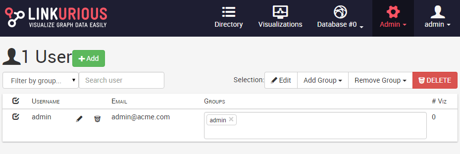
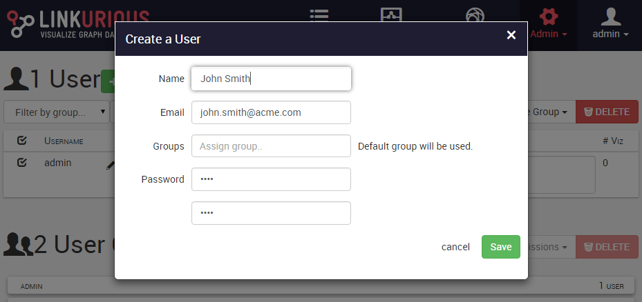
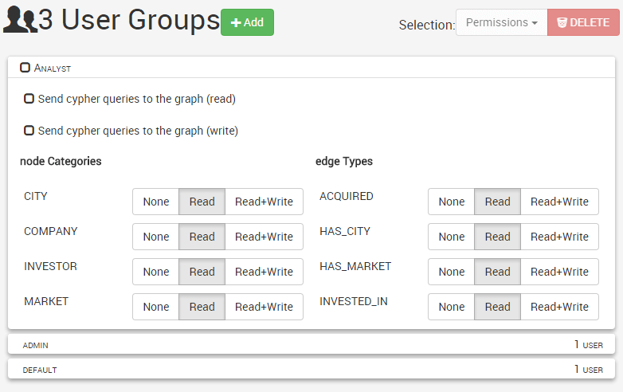

## Utilisateurs et groupes

### A propos des utilisateurs et groupes 

Linkurious Enterprise vous permet d'authentifier des utilisateur et de les assigner à des groupes. Les groupes d'utilisateur fournissent l'autorisation de lire ou d'écrire des noeuds et liens dans la base de données de graphes. Chaque permission est définie selon le niveau de catégories de noeuds et le type de liens. Les groupes sont définis pour chaque donnée source. Deux groupes d'utilisateurs sont disponibles par défaut:

*  Le groupe `admin` a accès à la LECTURE et l'ECRITURE des données de graphes
*  Le groupe  `default` a un accès de has READ-ONLY access to graph data.

Le groupe `default` est le groupe assigné par défaut à tout nouvel utilisateur. 
Les utilisateurs appartiennent à au moins un groupe. Ils peuvent être assignés à plusieurs groupes. Les droits d'accès résultants sont combinés comme suit: *the most permissive right wins*. Prenons l'exemple d'un utilisateur appartenant à deux groupes. Le premier groupe permet de lire les noeuds `CITY` et le second groupe ne permet rien sur les noeuds `CITY`, l'utilisateur aura la permission de lire les noeuds `CITY`.

### Tableau de bord de gestion des utilisateurs

Pour accèder au tableau de bord de gestion des utilisateurs, cliquez sur **Users** dans le tableau de bord administrateur, ou sélectionnez **Users** dans le menu **Admin** de la barre de navigation. 

Nous pouvons gérer quelconque utilisateur en cliquant sur **Edit** ou **Delete** à côté de l'utilisateur de notre choix. Nous pouvons aussi gérer les groupes d'utilisateurs. si vous supprimez le dernier groupe d'un utilisateur, il sera assigné au groupe par défaut `défaut`. 

### Créer de nouveaux utilisateurs

Les administrateur et l'utilisateur unique *"Unique User"* (utilisé quand l'identification d'utilisateurs n'est pas activée) peuvent créer des compte de nouveaux utilisateurs. Créons un nouvel utilisateur. Cliquez sur **Add** à côté de "1 User", puis remplissez tous les champs du formulaire. Notez qu'il est possible d'affecter un groupe à l'utilisateur. Cliquez sur **Save** une fois le formulaire rempli. 

### Créer et gérer les groupes d'utilisateurs

Les administrateurs et l'utilisateur unique peuvent créer des groupes d'utilisateurs et les assigner aux différents utilisateurs à partir du tableau de bord de gestion. Créons un nouveau groupe d'utilisateurs. Cliquez sur **Add** dans le tableau de bord des utilisateurs puis donnez lui un nom (par exemple *Analyst*). Par défaut, les utilisateurs de ce groupe seront autorisés à lire tous les noeuds et liens de l'actuelle source de données. Vous pouvez modifier les autorisations après création du groupe.

Dans l'image ci-dessus, nous pouvons voir par exemple que le groupe *Analyst* a seulement des droits de lecture (READ-ONLY) sur les villes, marchés, statrt up et investisseurs (`CITY`, `MARKET`, `STARTUP` et `INVESTOR`) de notre jeu de données.

Cliquez sur le bouton **Read+Write** pour permettre aux utilisateurs du groupe  *Analyst* de modifier les noeuds `CITY`. Cliquez sur `None` pour cacher les noeuds `MARKET` aux utilisateurs du groupe *Analyst*. Vous pouvez élargir les permissions en cliquant sur le nom du groupe et ouvrir le menu **Selection > Permissions**.

Finalement, vérifiez l'option **"Send cypher queries to the graph (read)"** pour permettre aux utilisateurs de ce groupe de démarrer des requêtes Cypher personnalisées dans la base de données de graphes. Cypher est le SQL pour les bases de données de graphes et est disponible dans la base de donnée de graphes Neo4j. Il fournit une syntaxe performante pour l'extraction de patterns avancés ou pour l'édition d'une base de données. Cette option est accessible aux utilisateurs dans la visualisation **Workspace** sous le menu **Find > Patterns**. Vous pouvez apprendre Cypher à l'adresse suivante [neo4j.com](http://neo4j.com/developer/cypher-query-language/).

  Les utilisateurs peuvent explorer la structure d'un graphe avec des requêtes Cypher même s'ils n'ont pas d'autorisation de lecture pour tous les noeuds. Certaines requêtes très complexes peuvent mettre la base de données de graphe dans un état instable, soyez vigilants lorsque vous assignez les droits pour permettre les requêtes. 

  Les utilisateurs peuvent supprimer vos données par erreur lorsqu'ils démarrent des requêtes d'écriture dans la base de données de graphes. Nous recommendons d'activer cette option seulement dans un environnement de développement et de la désactiver pour des bases de données de graphes en cours de production. Il est de bonne pratique de créer un groupe spécifique avec le moins de personnes possibles. 

