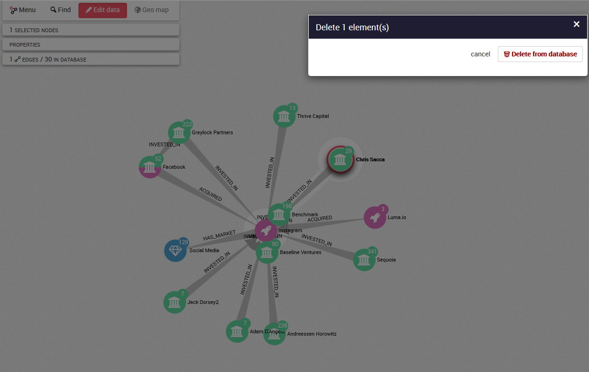

## Supprimer des noeuds et des liens

### Supprimer un noeud


Si nous souhaitons supprimer un noeud de notre base de données, nous sélectionnons le noeud que nous souhaitons supprimer en cliquant dessus puis nous effectuons un clic-droit sur le fond de notre graphe. Cliquez sur ```Delete selection``` dans le menu comme montré ci-dessous et cliquez sur ```Delete from Database```.




Le noeud est alors supprimé de notre base de données.


### Supprimer un lien

Si nous supprimer un lien de notre base de données, nous sélectionnons le lien que nous souhaitons supprimer en cliquant dessus puis nous effectuons un clic-droit sur le fond de notre graphe. Cliquez sur ```Delete selection``` dans le menu comme montré ci-dessous et cliquez sur ```Delete from Database```.


Le lien est alors supprimé de notre base de données.


