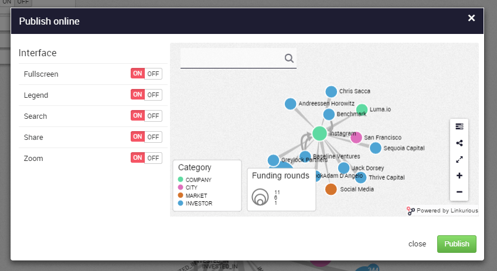
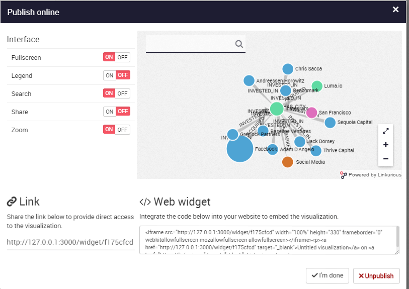

# Publier

Linkurious Enterprise offre la possibilité de publier des visualisations interactives en ligne. Les visualisations publiées peuvent être accessibles par une URL ou intégrée dans une page web. Elles contiennent une capture d'écran des données du gaphe au moment où la visualisation est publiée. L'auteur de la visualisation peut dépublier la visualisation à n'importe quel moment. Tout le monde peut explorer cette visualisation interactive, permettant une collaboration aisée autour des données du graphe. 

Nous pouvons publier une visualisation à partir de l'espace de travail en passant par le menu de gauche:


Avant publication, nous pouvons choisir plusieurs options afin de personnaliser l'interface:



Les options sont: 

- Fullscreen: pour fournir une vue plein écran du graphe;
- Legend: pour fournir une légende (ici "Category" à gauche de l'écran);
- Search: pour fournir une barre de recherche afin d'explorer le graphe;
- Share: pour partager une visualisation;
- Zoom: pour zoomer et dézoomer;


Dans la capture d'écran ci-dessous, nous avons désactivé l'option légende et l'option de partage. Nous pouvons voir que le bouton ```Share``` à droite de l'écran a disparu. Finallement, nous pouvons la publier: 




La visualisation est maintenant disponible en ligne. Nous pouvons partager le lien ou l'intégrer dans une page web en ajoutant le lien de la page dans le code source de la page internet.


<div class="alert alert-info">
    Si le serveur qui héberge Linkurious Enterprise est seulement accessible par intranet, la publication sera accessible seulement au sein de l'organisation et non à l'extérieur. 
</div>
