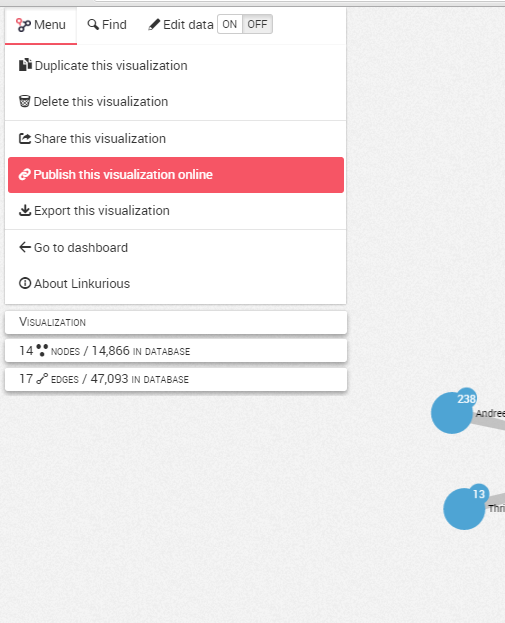
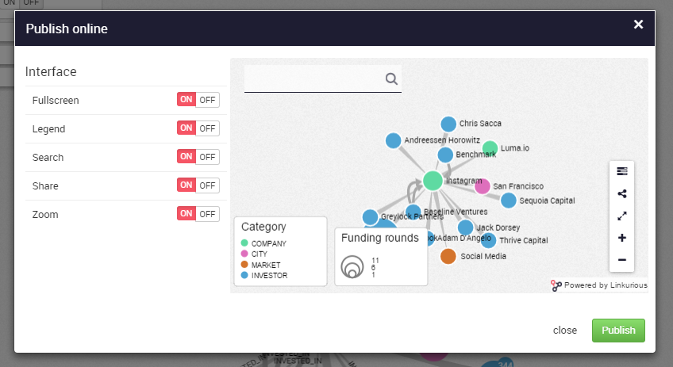
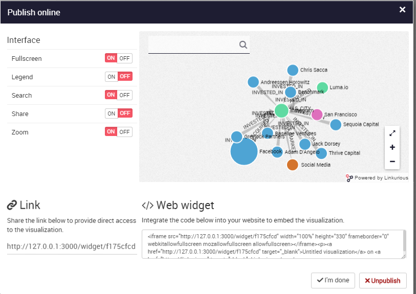

# Publish

Linkurious Enterprise offers the possibility to publish interactive visualizations online. Published visualizations can be accessed with an URL or embedded in a web page à la Google Maps. They contain a snapshot of graph data at the time the visualization is published. The visualization author can update or unpublish his visualizations anytime. Anyone can explore these visualizations interactively, enabling easier collaboration around graph data.

We can publish a visualization from the Worskpace via the left menu:



Before publishing a visualization, we can whoose various options to customize the interface: 



The options are:
- Fullscreen: to provide a fullscreen view of the graph
- Legend: to display a legend (here "Category" on the left of the screen)
- Search: to display a search bar in order to explore the graph
- Share: to share the visualization
- Zoom: to zoom in and zoom out


On the screenshot below, we have deactivate the legend option and the share option. We can see that the ```Share button``` on the right of the screen disappeared:


Finally, we can publish it:



The visualization is now available online!

<div class="alert alert-info">
    If the server that hosts Linkurious Enterprise is accessible via intranet only, published visualizations will be available within the organization and won’t be available outside.
</div>
