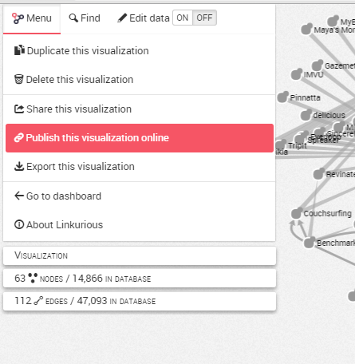
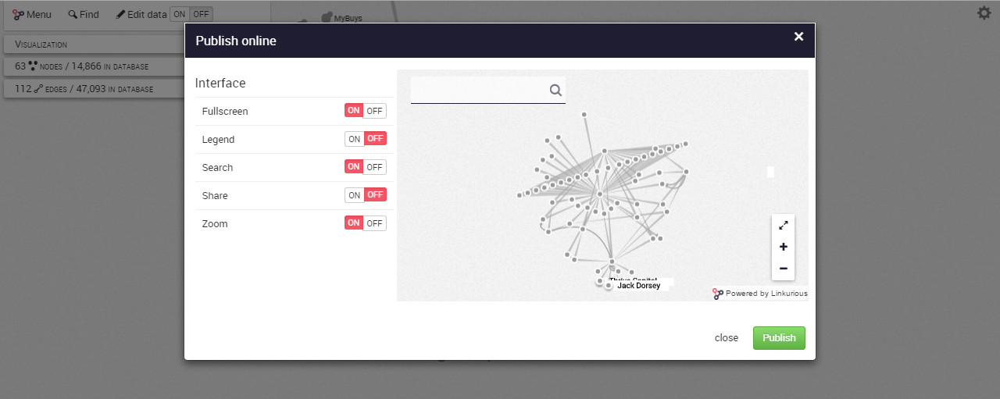
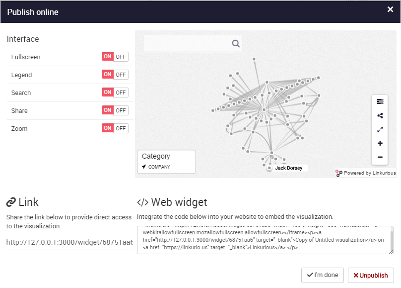

# Publish

Linkurious Enterprised offers us the possibility to publish a visualization.
We can thus send link to share a graph

We can publish a visualization from the Worskpace via the left menu:



Before publishing a visualization, we can whoose various options to share or not with people: 


The options are:
- Fullscreen: to provide a fullscreen view of the graph
- Legend: to display a legend (here "Category" on the left of the screen)
- Search: to display a search bar in order to explore the graph
- Share: to share the visualization
- Zoom: to zoom in and zoom out


On the screenshot below, we have deactivate the legend option and the share option. We can see that the ```Share button``` on the right of the screen disappeared:



Finally, we can publish it:


