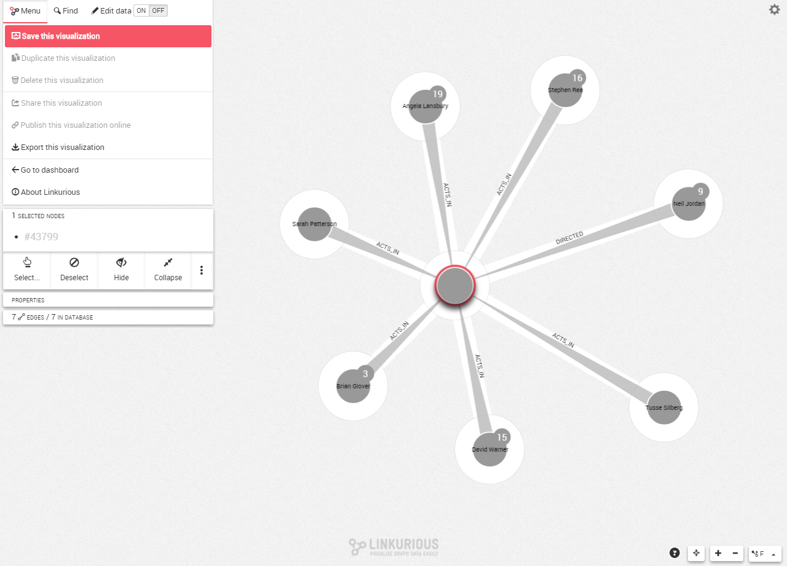
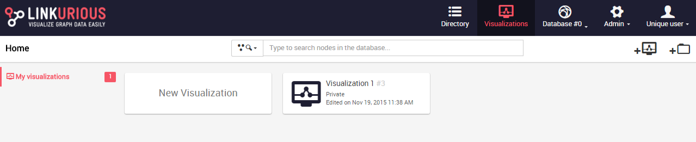

## How does the autosave work?

When we are working on a visualization, we can save it through the Menu button then click on SAVE. Further, the modifications will be automatically saved.

We can access to a saved visualization via the Linkurious Enterprise dashboard.

