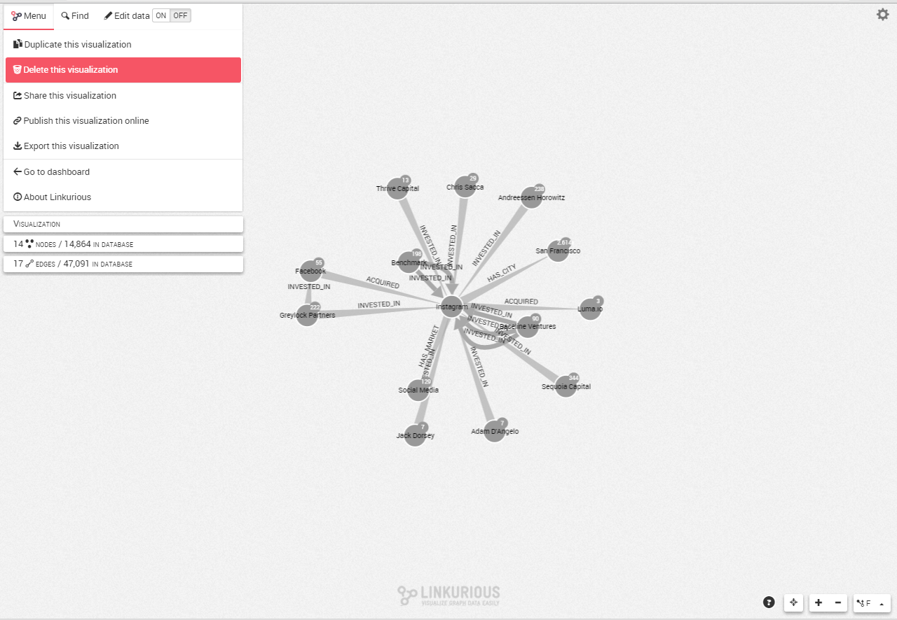

## Delete visualizations

### From the Workspace

We open the Workspace menu, then click on the ```Delete``` button. We confirm to delete the visualization.



### From the Dashboard

Either:

* Click on a visualization to select it, then click on the ```Delete``` button of the toolbar.


* Right-click on a visualization to open the context menu, then click on the ```Delete``` button.


The visualization is deleted after confirmation.
