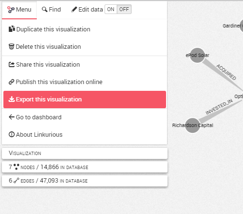

## How to export a visualization?

We have created a visualization and we want to share or modify its content. We open the Workspace menu, then click on the ```Export``` button.



The visualization data can be exported in the following formats:

* Excel 2007+ workbook
* CSV
* GEXF - compatible with [Gephi](https://gephi.github.io/)
* GraphML
* JSON
* PNG
* SVG (beta) - compatible with Inkscape and Adobe Illustrator for editing


After clicking on a format, the file is automatically downloaded by the browser.

The PNG export available here will create an image of the complete graph even if we are currently zooming to a specific area. Here is an example:


The PNG export is configurable: setting the zoom ratio of the exported visualization from 1 (zoomed out) to 0.2 (zoomed in) will not only adapt the size of the image, but will also influence the quantity of information displayed in the same way it is done on screen.

>> It is different from the ```Take Screenshot``` button available by right click in the Workspace or from the Actions menu, which creates an image of the displayed area on screen only.


