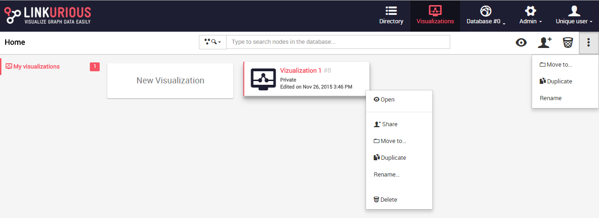
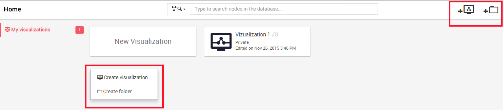
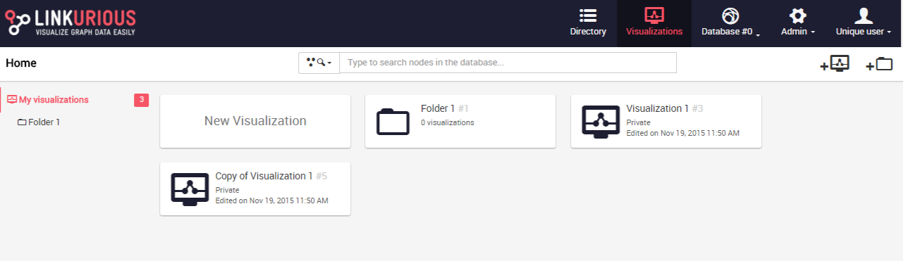
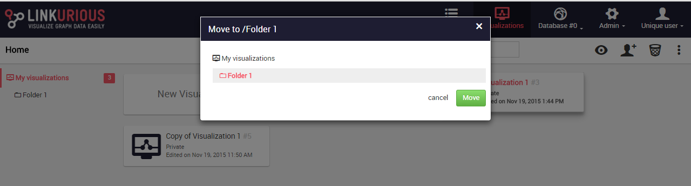

## Organize visualizations

Visualizations are by default added to the Dashboard. From the dashboard we can delete, rename or open a visualization.

We can also organize the visualizations in folders.

### Open, rename or delete a visualization

The following actions are possible either when we right-click on a visualization or on the right menu of the dashboard:
* open: opens the visualization where you left it (with the colors, sizes and filters);
* share: shares the visualization;
* move to: moves to a folder;
* duplicate: duplicates the visualization;
* rename: renames the visualization;
* delete: deletes the visualization.




### Arrange visualizations in folders

To create a folder, we either right-click on the dashboard background or in the right menu ```Create folder```.



We enter the name of our folder.


We hit ```Save```. Our folder is created.



We open the folder by clicking on it. If we want to move a visualization into the folder we used the actions ```move to``` when right-clicking on our visualization: 


We select the folder we want to move to our visualization:



The visualization has been moved to the folder.

