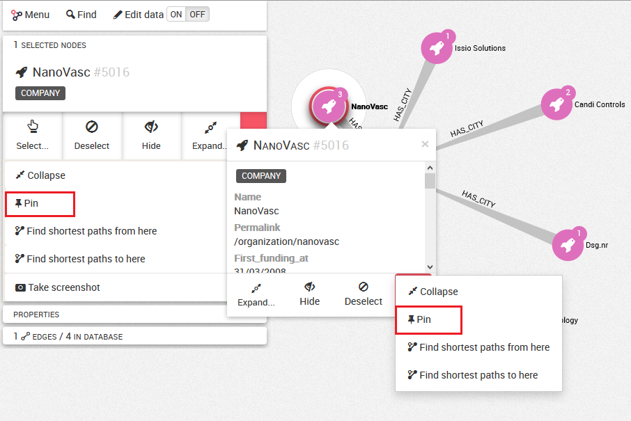
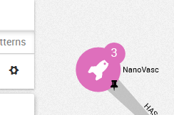
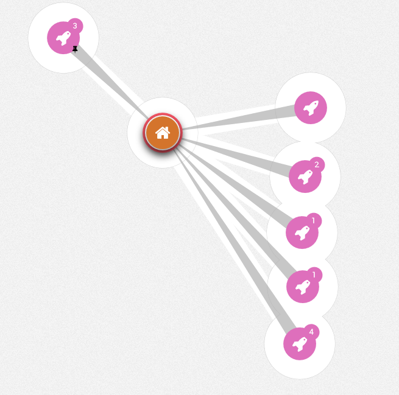

# Pinning the nodes

It is possible to pin the nodes on your graph visualization.
Pinning a node allow to fix it at a specific place on the graph.

To pin a node we can eiter click on the ```Pin``` button of the left panel or right-click on a node then select the ```Pin``` button.



A pin symbol appears on the node.



If we pin a node, this node will stay at the same place when we move the rest of the graph, for example using the force-directed layout option (See Manipulate):

  