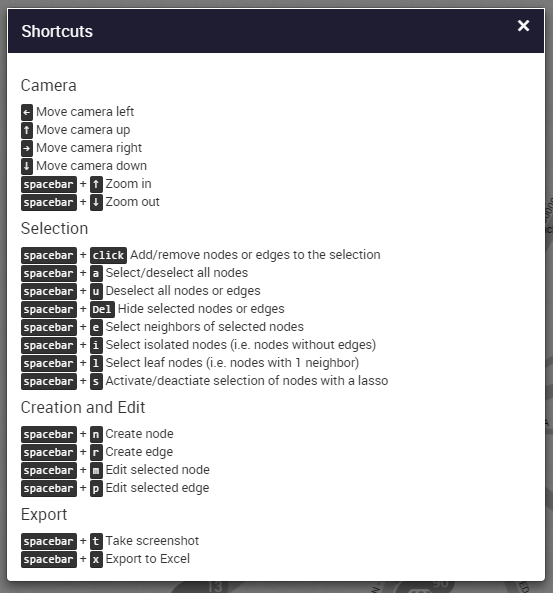
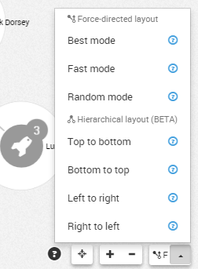
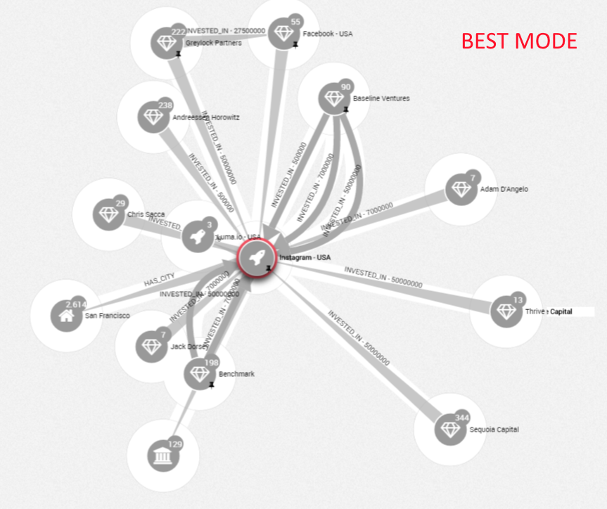
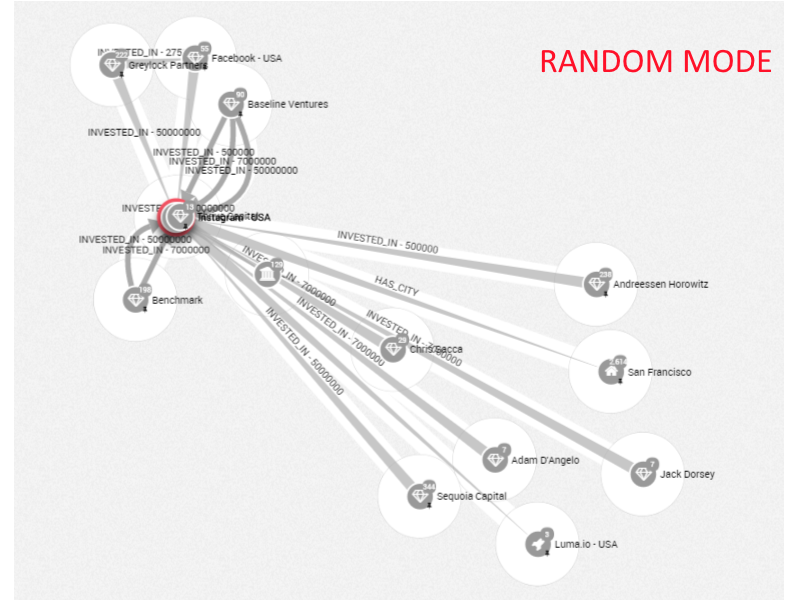

# Workspace

When we are on the Workspace of our graph, different options are available on the right-bottom of the screen: 


Here are the different options:

- The ```shortcuts``` button: , give access to a list of shortcuts usable working on a graph :



- The ```Locate``` button , center the graph on the screen
- The ```Zoom In/Zoom Out``` button  is to zoom in or zoom out on our graph
- The ```Fast force layout``` button give us various options to organize our graph



Below we can see an exemple of the Best mode versus Random mode:


