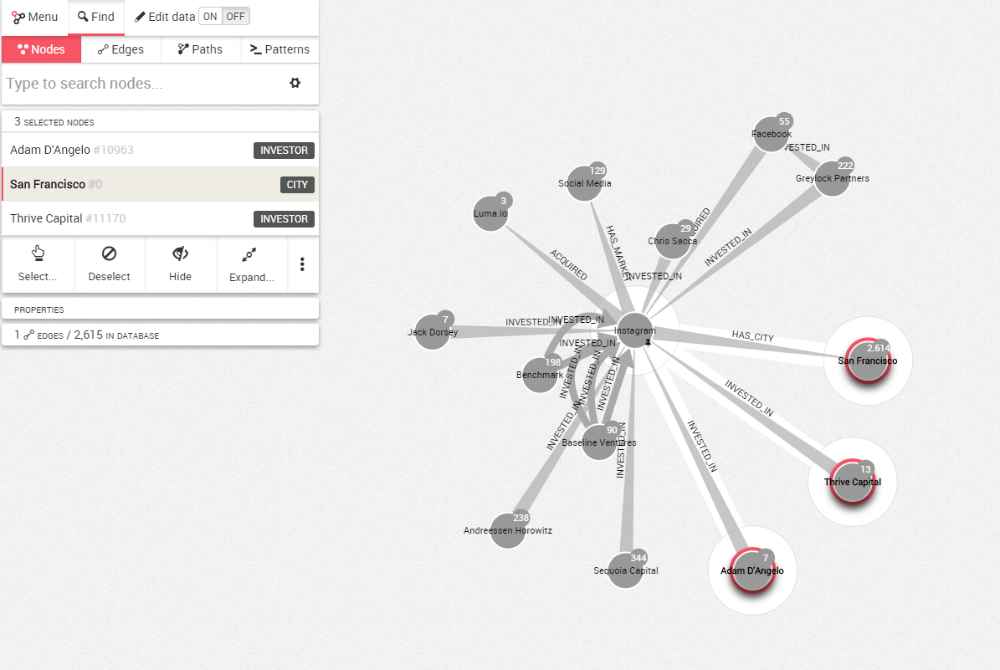

## Hide nodes and edges

Your visualization is getting too complex and you may want to remove a few nodes or edges to make it easier to understand.

Simply select the node(s) or edge(s) you want to remove with one of the tool described earlier in this chapter.


For example, in the picture above I have selected three nodes. I simply have to click on ```Hide``` to remove them from the visualization.



My two nodes are now removed from the visualization.


If we use de Toggle Lasso option to select the nodes we want to delete, we need to make sure the central node is not selected otherwise all the edges raising from this node will also be hidden.