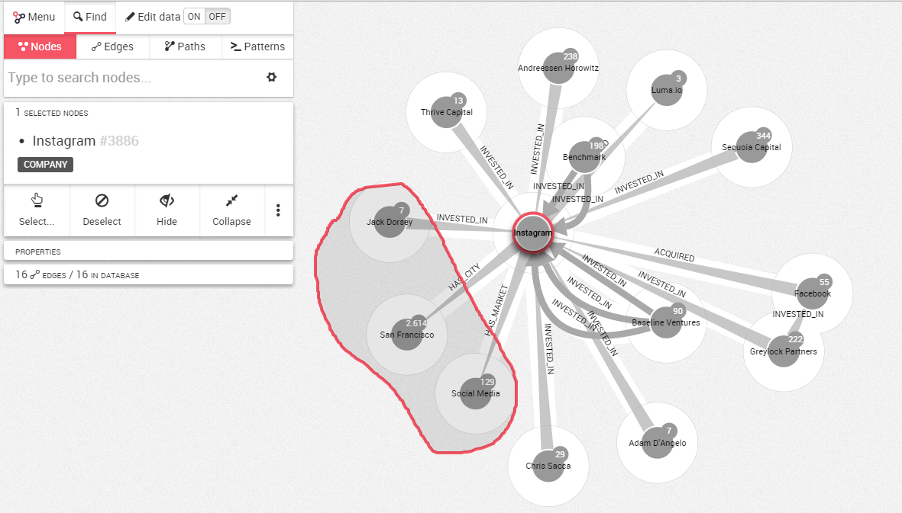
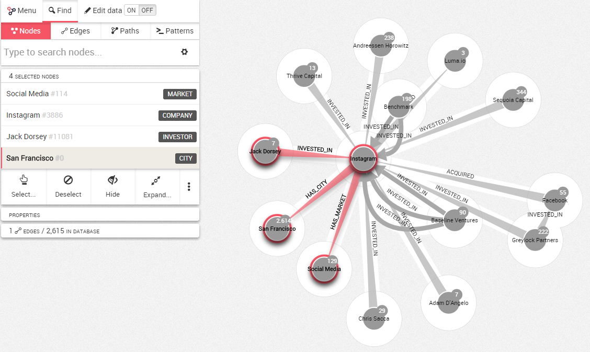

## Using The Lasso

It is possible to select the nodes or edges within a particular area of your visualization. For that, Linkurious Enterprise provides a lasso.

To do it, choose ```Select``` in the information panel on the left. 
Select ```Toggle lasso```.
Move the lasso around the nodes you are interested in selecting to select them.



Release the mouse when you are finished and your selection is activated.

