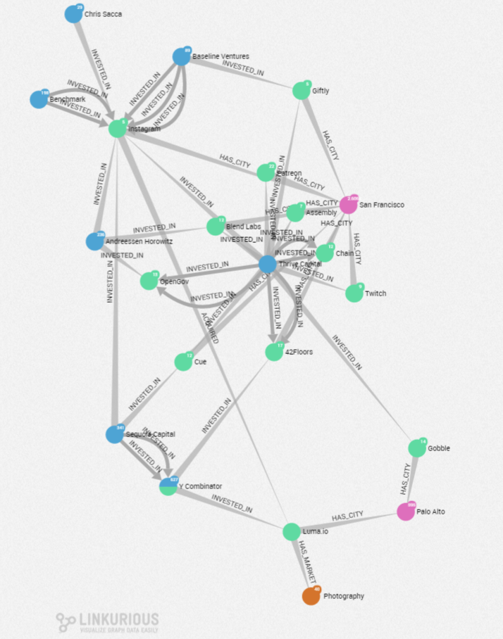
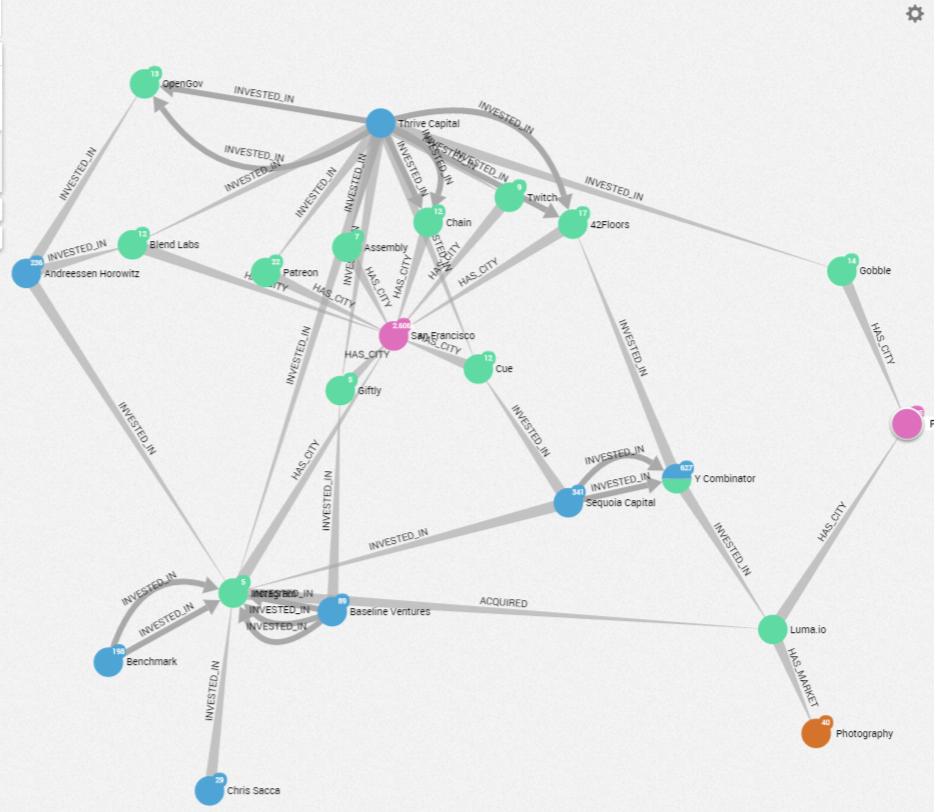
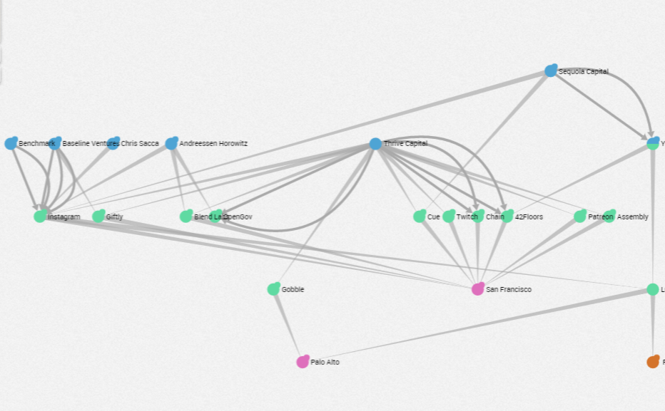
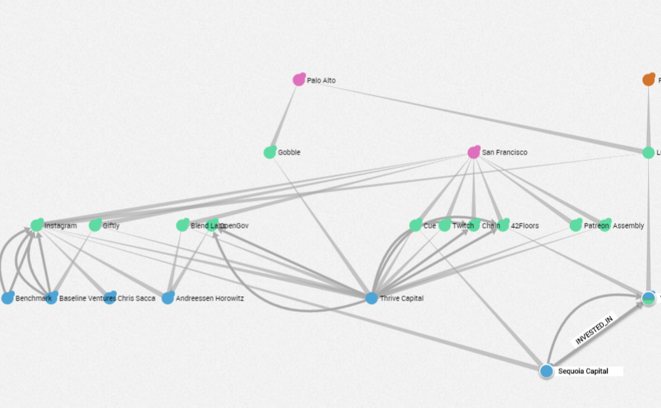

## The different shortcuts in Linkurious Enterprise

### Camera

```←``` Move camera left

```↑``` Move camera up

```→``` Move camera right

```↓``` Move camera down

```spacebar``` + ```↑``` Zoom in

```spacebar``` + ```↓``` Zoom out

### Selection

```spacebar``` + ```click``` Add/remove nodes or edges to the selection

```spacebar``` + ```a``` Select/deselect all nodes

```spacebar``` + ```u``` Deselect all nodes or edges

```spacebar``` + ```Del``` Hide selected nodes or edges

```spacebar``` + ```e``` Select neighbors of selected nodes

```spacebar``` + ```i``` Select isolated nodes (i.e. nodes without relationships)

```spacebar``` + ```l``` Select leaf nodes (i.e. nodes with 1 neighbor)

```spacebar``` + ```s``` Activate/deactiate selection of nodes with a lasso

### Creation and Edit

```spacebar``` + ```n``` Create node

```spacebar``` + ```r``` Create edge

```spacebar``` + ```m``` Edit selected node

```spacebar``` + ```p``` Edit selected edge

### Export

```spacebar``` + ```t``` Take screenshot

```spacebar``` + ```x``` Export to Excel

### The Full list

The list of shortcuts is directly available in right bottom of the workspace.


### Layouts

When we are on the Workspace of our graph, different options are available on the right-bottom of the screen: 


Here are the different options:

- The ```shortcuts``` button: , give access to a list of shortcuts usable working on a graph :


- The ```Locate``` button , center the graph on the screen
- The ```Zoom In/Zoom Out``` button  is to zoom in or zoom out on our graph
- The ```Fast force layout``` button give us various options to organize our graph


The *Best Mode*


The *Fast Mode*

The *Random Mode*

The *Top to bottom Mode*

The *Bottom to top Mode*

The *Left to Right Mode*

The *Right to Left Mode*


Below we can see an exemple of the Best mode versus Random mode:


