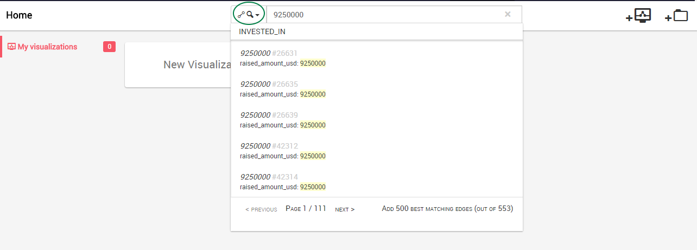
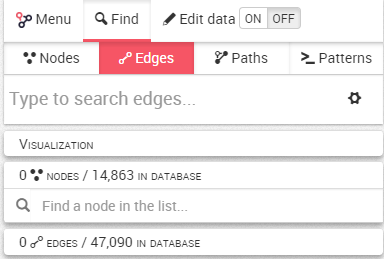

## Search relationships

We may have millions of relationships in our graph. What if we want to look at a specific relationship? 

The first possibility is to use the Quick Search bar, where we can either choose to look at nodes or edges (green circle). Here we look at edges:



The second possibility is to use the search bar in the Linkurious Enterprise interface once we have created a New Visualization 


By default the search bar searches nodes. To search a relationship, we click on the ```Edges``` tab.



Now, it works exactly like the search for nodes.

We simply type what we are looking for. We see the list of suggestions that match our search.


In the search result, we can see that there is a relationship that has the value ```1925000``` for the property ```raised_amount_usd```.

We choose the result we are interested in by clicking on it. It is immediately added to the canvas where we can visualize it.


