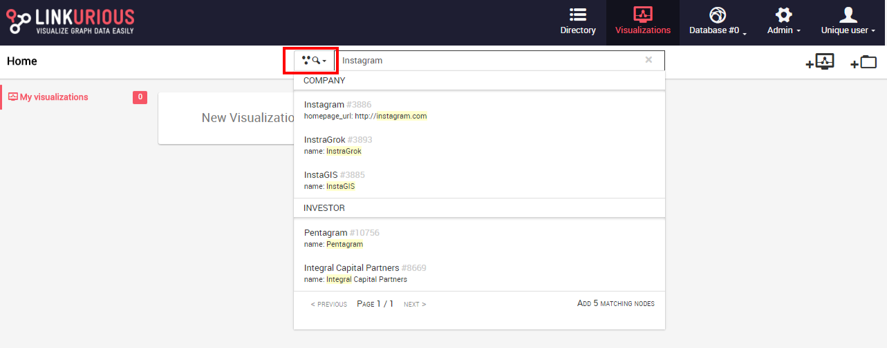
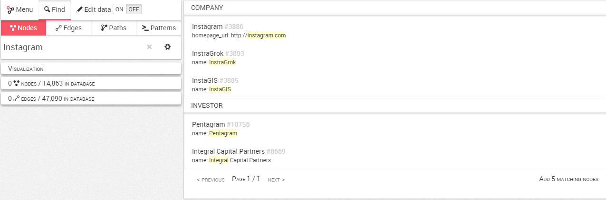

## Search nodes

We may have millions of nodes in our graph. What if we want to look at a specific node?

The first possibility is to use the Quick Search bar from the Dashboard Visualizations, where we can either choose to look at nodes or edges (red square). Here we look at nodes:



The second possibility is to use the search bar in the Workspace once we have created a New Visualization 


We can look for a node typing the name of any of its properties. Here, for example, we look for the property Instagram. We see the list of suggestions that match our search.



All the entries in the database containing the word ```Instagram``` will appear. These results are grouped by categories and sorted by relevance.

For each result we can see
- The name of the node and its ID number generated by the database (Instagram, #3886)
- The property that matches our search, highlighted in yellow (Here, the permalink of the company ```Instagram``` contains the text ```Instagram``` that matched our search)


We click on the result of our choice, it will be added to the canvas. Now we can visualize it.

> How it works : by default, Linkurious Enterprise indexes all the properties of your graph. If any property of a node matches your search, it will be returned.


> For example, you could find the ```Instagram``` node by typing ```instagram```, or ```USA``` or ```2010-03```.


The search bar in the Workspace provides an Advanced Search option not available through the Quick search bar of the Visualizations Dashboard. We can thus reduce the results to the category we are interested in. Those options are described in the Advanced search section.


