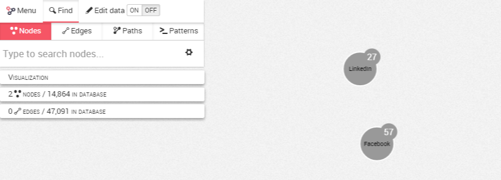
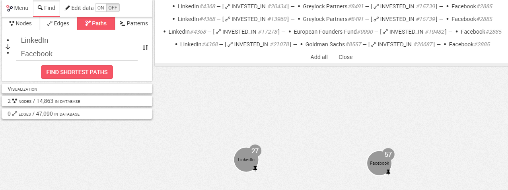

## Search for a shortest path

Linkurious Enterprise provides an option to find the shortest past between two nodes in our graph.
Here, we will be looking for the connections between the companies Facebook and LinkedIn.

We start with 2 seemingly disconnected nodes, ```Facebook``` and ```LinkedIn``` that are in our visualization.



We select the ```Finder```. Next we choose ```Path```. 
Now we choose the ```starting node``` (LinkedIn) and the ```destination```(Facebook).


We click on ```Find shortest path```. The results are now displayed.



We can choose ```Add all``` to view all the results or choose our preferred path by clicking on it. Our choice is added to the visualization.


