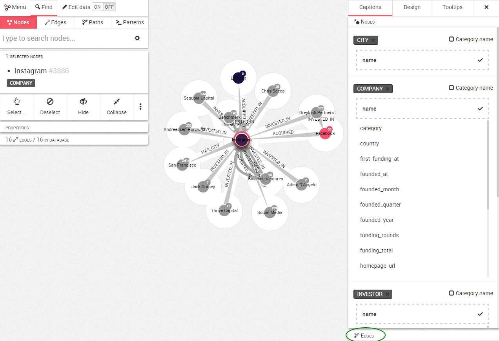
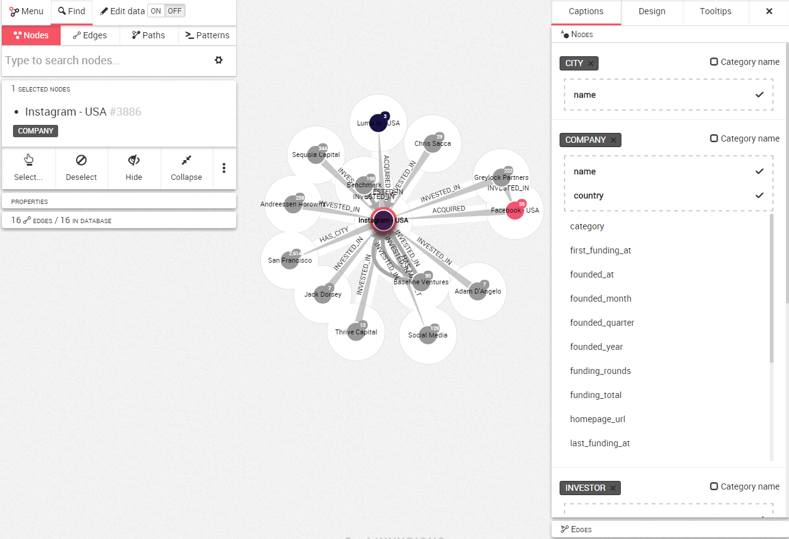

## Customize the captions

Linkurious Enterprise lets you choose which of the properties of your graph should be displayed on the canvas.

 At he moment on our graph, Linkurious Enterprise only displays the ```name``` of the nodes. 
 In order to customize this, we need to open the design panel on the right.
 
 We arrived on the ```Captions``` tab. Here we can see the different properties of the nodes in our graph. The ```name``` property is first. In the bottom of the screen, it is possible to select the edges.



For example, we want to show the ```country``` in the visualization. To do it, we simply click on ```country``` and it will be added to the dotted caption on the top of the list.



Now the text displayed next to your node changes. Instead of looking at ```Instagram``` we are looking at ```Instagram - USA```.

The same approach can be used for the edges.

> Linkurious Enterprise will use the properties in the order it appears in the list. Placing the cursor on one property, we have the possibility to change the order or to remove a property. If a node doesn't have a property, Linkurious Enterprise will look for the next property, etc.


