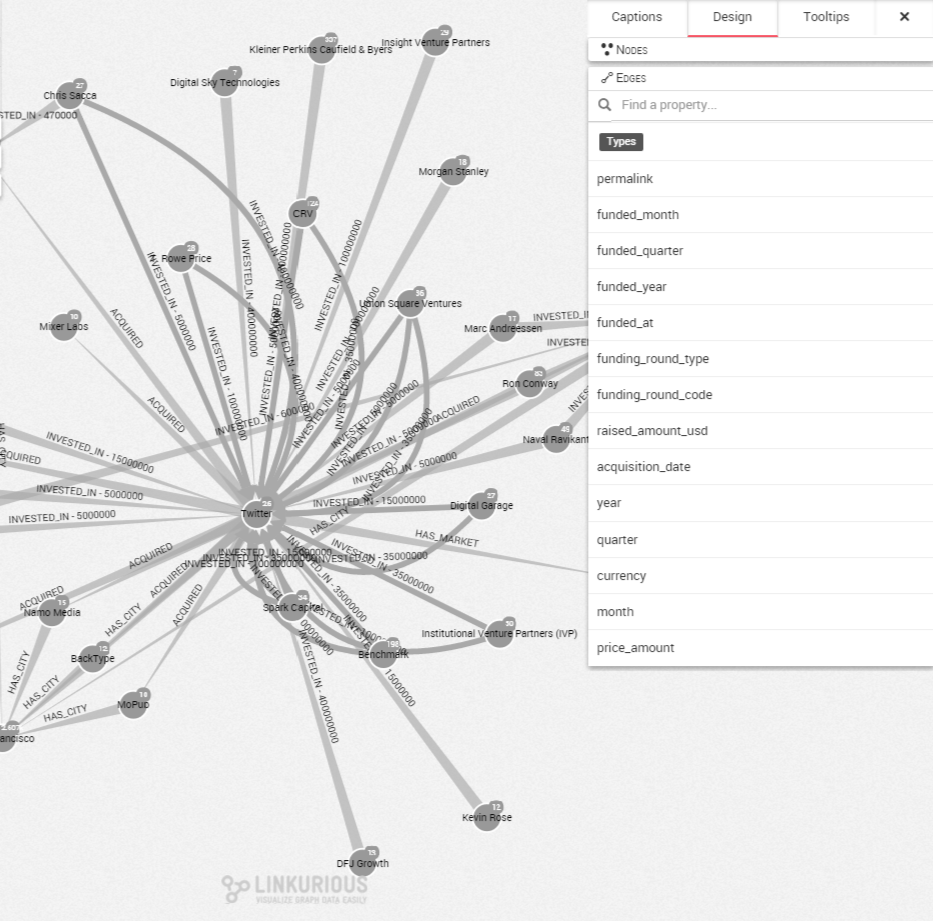
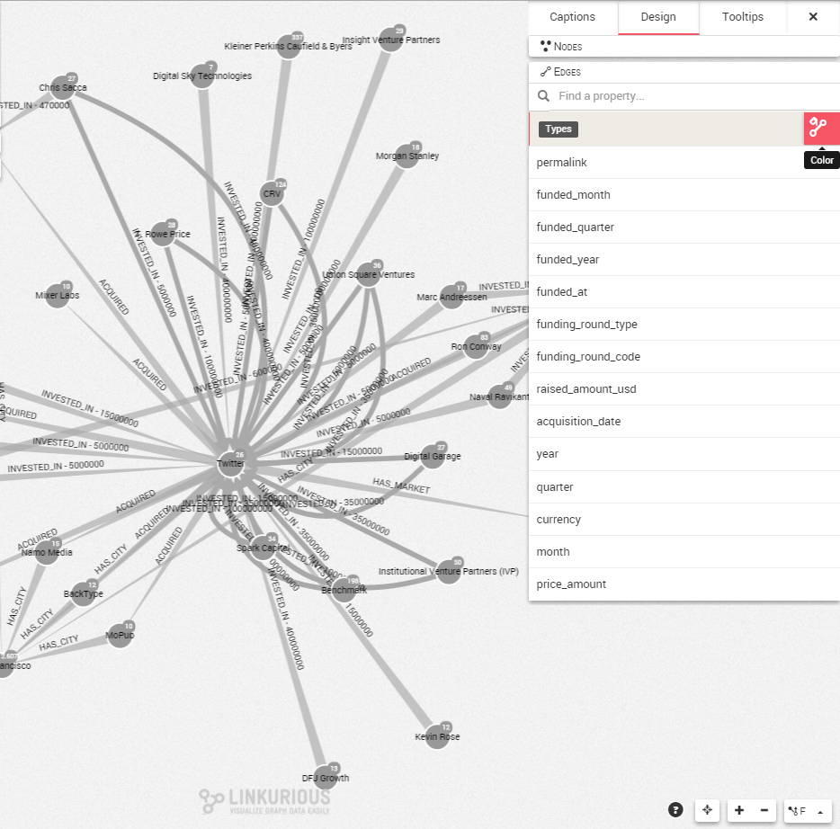

## Coloring the edges according to a property

Coloring the edges works exactly the same than coloring nodes like presented previously.

If all your nodes or edges have the same color, it is difficult to distinguish differences between them without looking at their individual properties. A great way to circumvent that issue is to choose to color the edges according to a certain property.

First of all, let's open the design panel on the right corner of the screen and hit the ```Design``` tab. By default we can see the properties of the nodes. We click on the ```edges``` tab on the bottom.



If we look at the property ```type```, in the design panel we can see:

* the different values associated with the ```type``` property (INVESTED_IN, ACQUiRED, HAS_CITY and HAS MARKET)


And hitting the color button we can can see

* how many occurences of each value there is (there are 39  nodes with the value ```INVESTED_IN```);
* which color is associated to which value (```ACQUIRED``` is blue)

To color the edges according to another property, the same approach can be used. If we want to unset the colors for a property, we click on the color button next to the property.

To color another property, the same approach can be used. 
If we already have colored a property, we first need to unset colors by hitting again the color button:



Then, we repeat the same approach for another property. 

If we look at the property ```year```, in the design panel we can see:
* the different values associated with the ```year``` property (2009, 2010, 2011, 2012, 2013, 2014)


And hitting the color button we also can see

* the number of occurences of each value there is (there are 2 nodes with the value ```2011```);
* which color is associated to which value (```2009``` is green)
* 

Our edges are now colored according to their ```year``` property

> We can see that the edges that do not have a ```year``` property are not colored. They remain in grey.