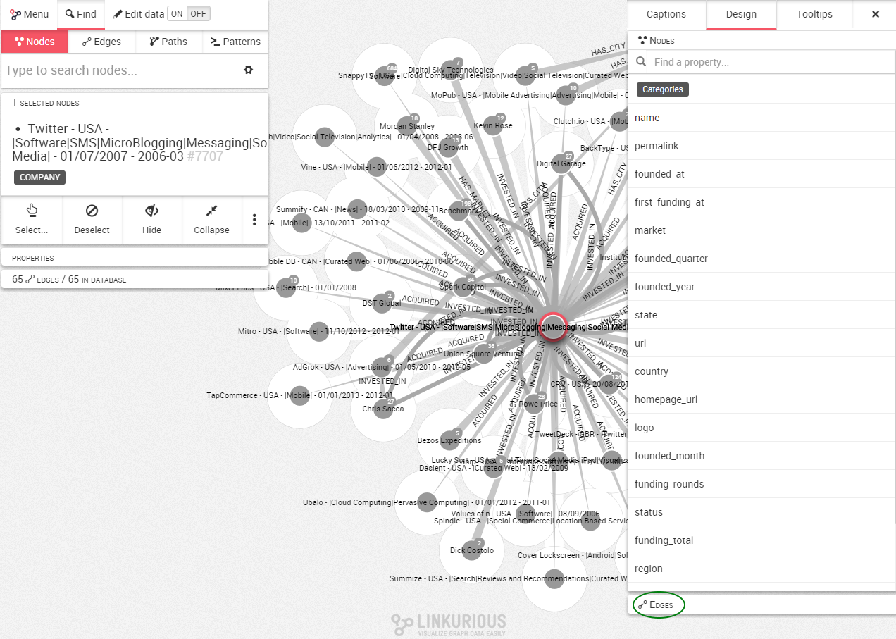

## Coloring the edges according to a property

Coloring the edges works exactly the same that coloring nodes like presented previously.

If all your nodes or edges have the same color, it is difficult to distinguish differences between them without looking at their individual properties. A great way to circumvent that issue is to choose to color the edges according to a certain property.

First of all, let's open the design panel on the right corner of the screen and hit the ```Design``` tab.By default we can see the properties of the nodes. We select the ```edges``` tab on the bottom.




If we look at the property ```type```, in the design panel we can see:

* the different values associated with the ```type``` property (INVESTED_IN, ACQURED, HAS_CITY and HAS MARKET)


And hitting the color button we also can see

* how many occurences of each value there is (there are 36 nodes with the value ```USA```);
* which color is associated to which value (```USA``` is velvet)


> We can see that the nodes that do not have a ```country``` property are not colored. They remain in grey.
By default the edges are not colored.


It is as simple as going over ```type``` and selecting ```Colors```.


Immediately the edges in our visualization are colored according to their ```type```.


In the design panel, we can see :
* the different values associated with the ```type``` property (HAS_ACQUIRED and HAS_INVESTED_IN);
* how many occurences of each value there is (there are 5 edges with the value ```HAS_INVESTED_IN```);
* which color is associated to which value (```HAS_INVESTED_IN``` is blue).
