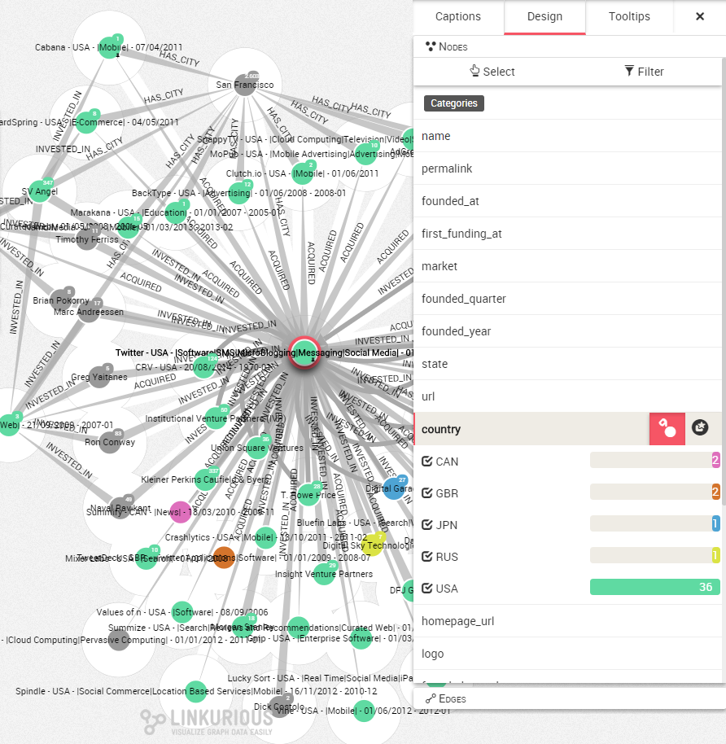

## Coloring the nodes according to a property

If all your nodes or edges have the same color, it is difficult to distinguish differences between them without looking at their individual properties. A great way to circumvent that issue is to choose to color the nodes according to a certain property.

For example, our nodes may have a ```country``` property that we would like to highlight, thus Linkurious Enterprise enables us to color the nodes according to a particular property, here ```country```.

This way, a French and a German start-up will have different colors. It will be easier to distinguish them visually.

In the picture below, we see the start-ups and investors Twitter is connected to. At first glance we have no idea where they are coming from.


First of all, let's open the design panel on the right corner of the screen and hit the ```Design``` tab.



If we look at the property ```country```, in the design panel we can see:
* the different values associated with the ```country``` property (CAN, GBR, JPN, RUS, USA);

And hitting the color button we also can see

* how many occurences of each value there is (there are 36 nodes with the value ```USA```);
* which color is associated to which value (```USA``` is green)

Here, our nodes are colored according to their ```country``` property

> We can see that the nodes that do not have a ```country``` property are not colored. They remain in grey.

To color another property, the same approach can be used. If we want to unset colors for a property, we click on the color button next to the property.
