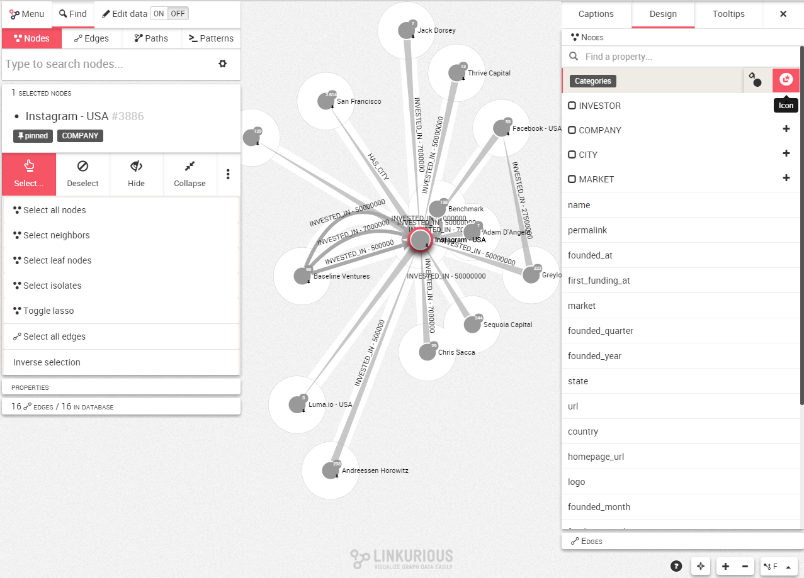
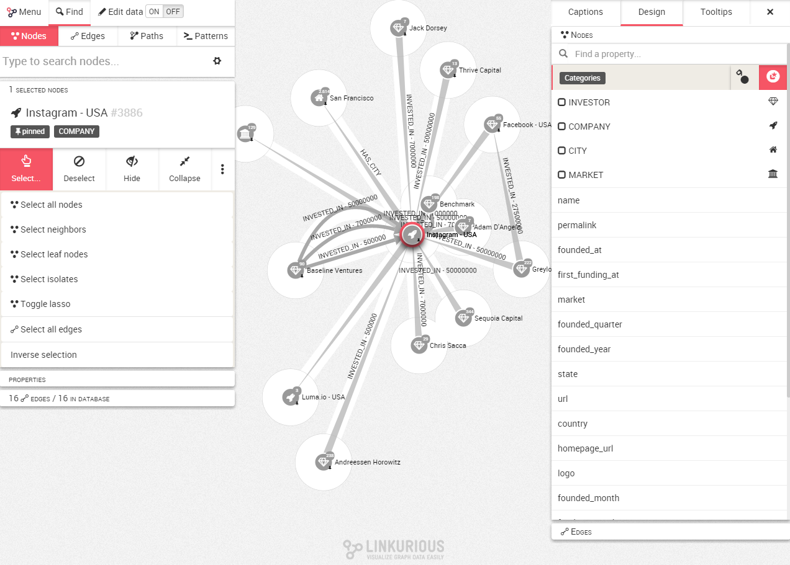

# Icons

In order to obtain a more intuitive visualization, Linkurious Enterprise allows you to change the node appearance with a set of Icons provided by ```Font Awesonme``` (https://fortawesome.github.io/Font-Awesome/)

We click on the upper right corner to open up the design panel and choose the Nodes tab.

We move the mouse to ```categories``` for example and we have acces to both the button to color the nodes or to change their icons. 



Hiting the "+" button, the list of icons available appears:


We can thus illustrate our graph con icons to directily obtain a visal explication of the data t first glance




Here we have chosen 4 different icons to differentiate the Company nodes according to their property
- The Investors are represented with a Diamond icon
- The Companies are represented with a Rocket icon
- The Cities are reprensented with a Home icon
- The Markets are represented with a Institution icon