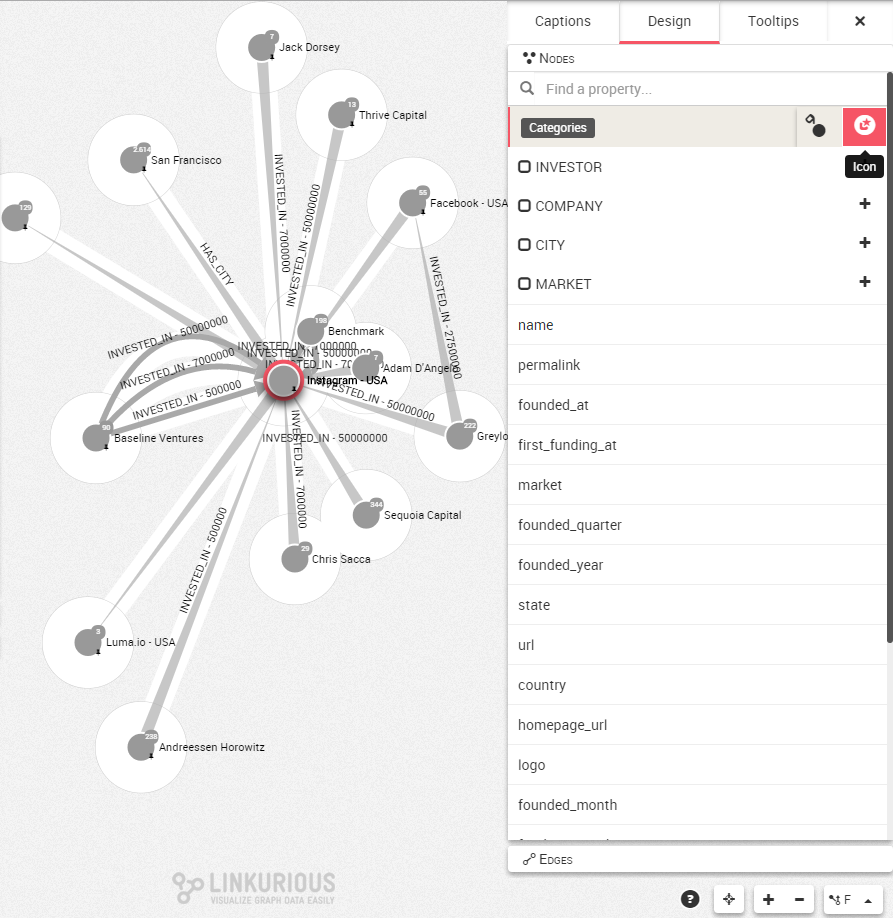
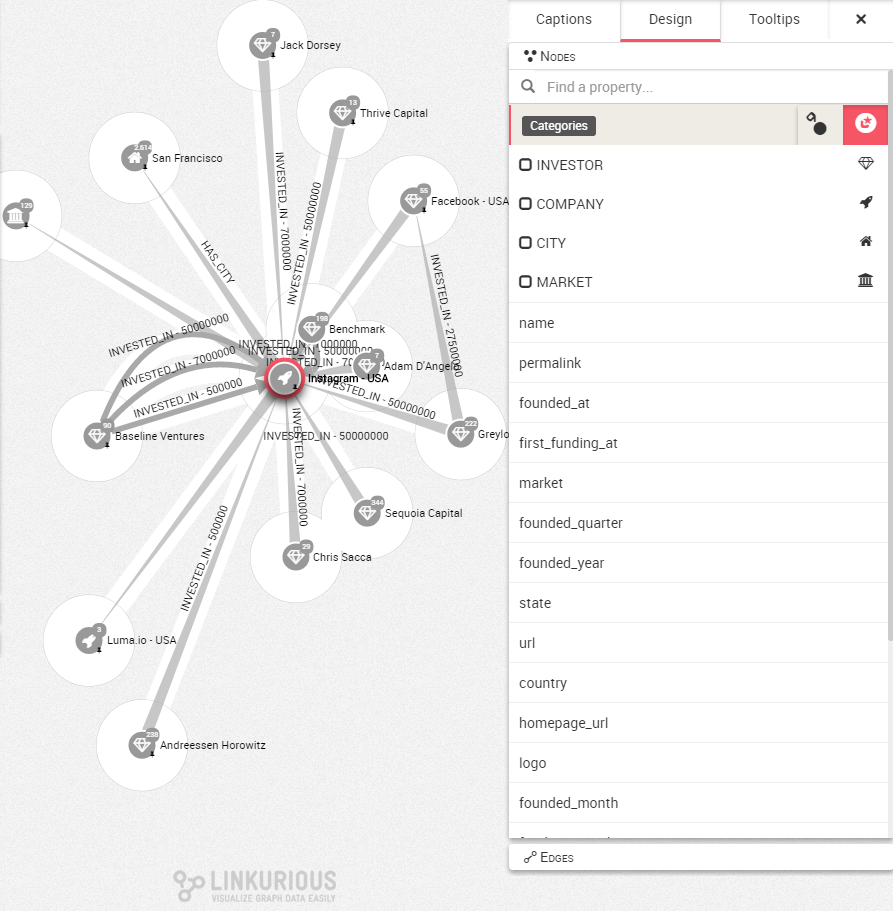

# Icons

In order to obtain a more intuitive visualization, Linkurious Enterprise allows you to change the appearance of nodes with a set of icons provided by ```Font Awesonme``` (https://fortawesome.github.io/Font-Awesome/)

We click on the corner of the Workspace to open up the Design panel and choose the Nodes tab.

We move the mouse over ```categories``` for example and we have access to both the button to color the nodes or to change their icons. 



Hiting the "+" button, the list of icons available appears. It is then possible to select the icon we want to illustrate our property.


We can thus illustrate our graph con icons to directly obtain a visual explanation of the data at first glance




Here we have chosen 4 different icons to differentiate the ```Company``` nodes according to their property
- The Investors are represented with a Diamond icon
- The Companies are represented with a Rocket icon
- The Cities are represented with a Home icon
- The Markets are represented with a Institution icon