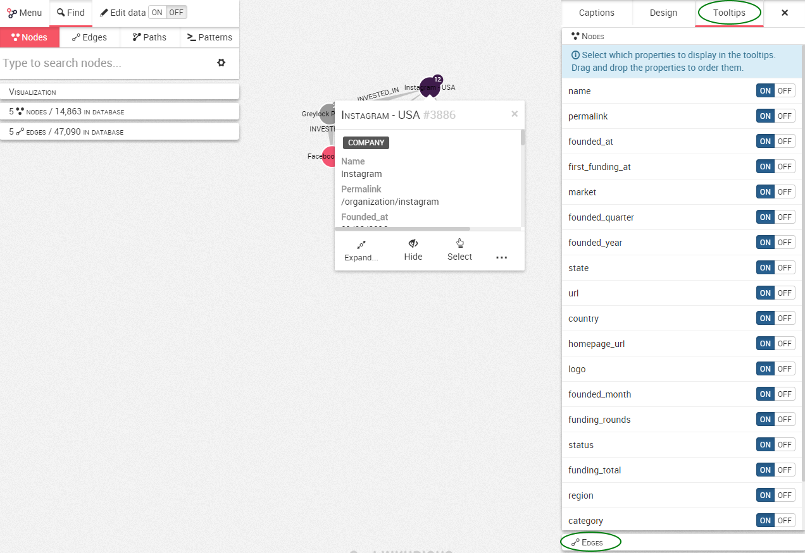

## Customize the tooltip

When you right-click on a node or an edges, you can view its properties in a pop-up menu called a tooltip.


We can see that our node is a ```Company``` whith the ```permalink``` /organization/instagram

It is possible to customize the content of the tooltip and to display only certain properties.

In order to customize this, we need to open the design panel on the right and let's go to the ```Toolstips``` tab.



 Here we can see the different properties of the nodes in our graph. By default all the properties are ```on``` and are thus displayed. In the bottom of the screen, it is possible to select the edges.


Simply turn off the properties you do not want to display. Here we are going to turn off the ```name``` and ```country```.


The  ```country ``` and  ```name ``` are now removed from the tooltip.


