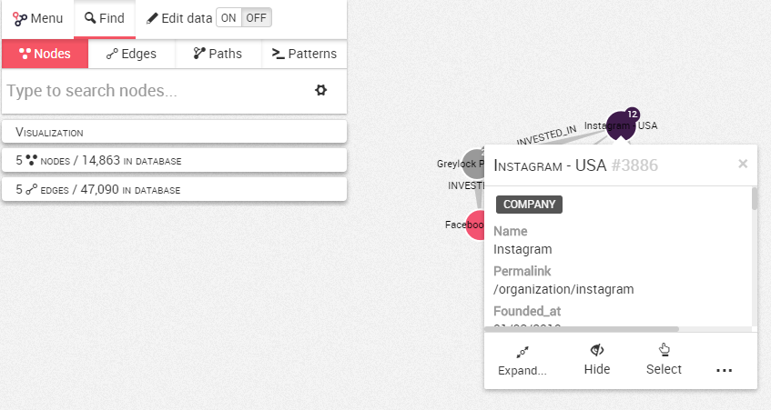
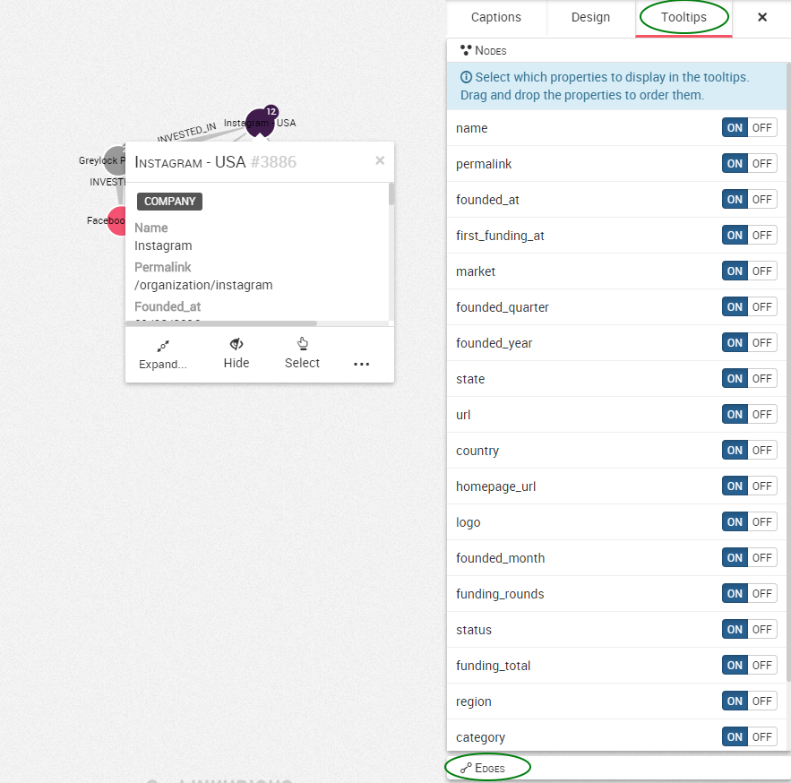

## Customize the tooltip

When you right-click on a node or an edge, you can view its properties in a pop-up menu called a tooltip.



We can see that our node is a ```Company``` whith the  ```/organization/instagram``` permalink

It is possible to customize the content of the tooltip and to display only certain properties.

In order to customize this, we need to open the design panel on the right and we go to the ```Tooltips``` tab.



 We can see the different properties of the nodes of our visualization. By default all the properties are ```on``` and are thus displayed. In the bottom of the screen, it is possible to do the same with the edges.

We can turn off the properties you do not want to display. 

